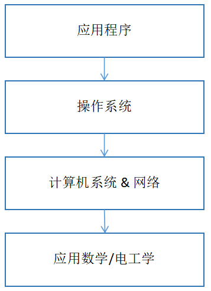
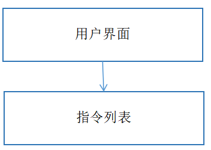
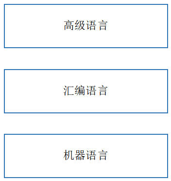
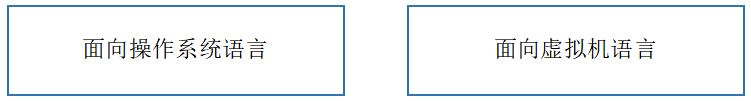
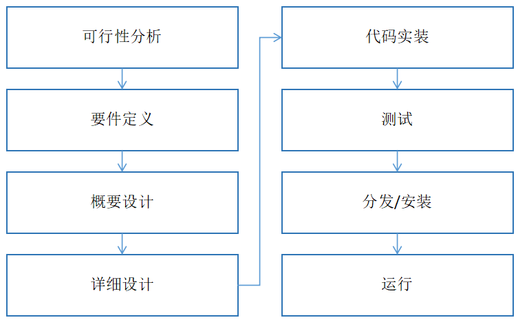
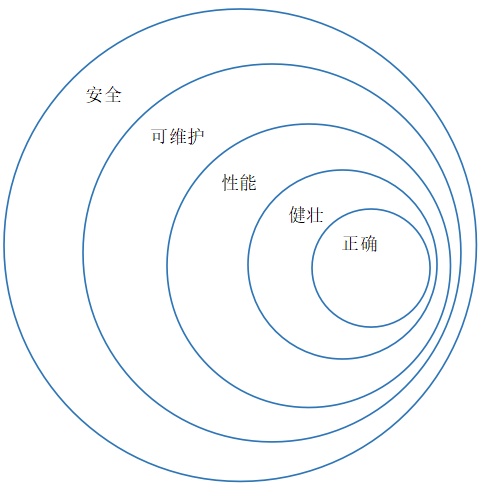

# 软件开发概论
---

### 软件的本质

软件即机器。譬如微信，用于实时通讯、支付等，各类小程序提供各不相同的功能。

### 应用程序

- 应用程序是面向业务的软件。

- 应用程序界面有以下两种：

  1. 命令行/控制台用户界面（Console User Interface CUI）
  2. 图形用户界面（Graphic User Interface GUI）

- GUI又有以下两种：
  1. 富客户端（Rich Clinet），是通过操作系统直接渲染界面，界面表现丰富，像桌面游戏，手机上的微信等
  2. 瘦客户端（Thin Client），通过浏览器呈现网页来显示，需要向服务器请求下载网页。当然，在网页上也可进行操作（通过脚本）

- 指令列表
  计算机从列表中读取指令，一条一条顺序执行

### 开发语言

- 简史

  

  - 机器语言
    计算机唯一认识的语言，是`0`和`1`的序列
  - 汇编语言是一种低级的编程语言，它使用易于理解的助记符（如 MOV, ADD, JMP）与计算机的硬件（主要是CPU）进行直接交互。它是机器指令的可读性表示，与计算机的体系结构紧密相关
  - 高级语言与人类语言特别是英语接近，容易编写与阅读

- 类型

  

  - 解释型语言需要一个解释器读入源代码来执行
  - 编译型语言需要进行编译，编译后的代码可被操作系统或虚拟机来执行

- 执行

  

  - 面向操作系统的语言编译后可直接在对应的操作系统上执行，不同的操作系统需要分别编译（可能需要修改），内存由程序员来管理，如`C`、`C++`等
  - 面向虚拟机的语言编译为特定的中间语言，由虚拟机在执行时再编译为面向操作系统的代码，虚拟机托管执行，内存由虚拟机管理，如`Java`、`C#`、`Python`等

### 软件开发过程
  

  - 可行性分析
    商业，技术等可行性分析

  - 要件定义
    弄清楚“要做什么”以及“做到什么程度”，并将这些内容以清晰、无歧义的形式文档化。

  - 概要设计
    负责确定系统的整体结构和方案。

  - 详细设计
    详细设计是在概要设计的基础上，对系统的每一个模块、组件或类进行深入细化，描述其具体的实现逻辑、算法、数据结构、接口细节和错误处理。

  - 代码实装
    代码实装是将详细设计文档转化为实际可运行的源代码的过程。

  - 测试
    在将软件交付给用户之前，尽可能早、尽可能多地发现缺陷（Bug），并验证软件是否满足需求。

  - 分发/安装
    将开发完成并测试通过的软件产品交付到目标用户手中，并使其能够顺利运行。

  - 运行
    在目标环境中被启动、执行，并持续处理用户请求、完成其设计功能的过程。这个阶段不再是开发，而是转向维护、监控和优化，以确保服务的可用性、性能和可靠性。

### 软件质量
  

  - 正确
    行为严格符合其规格说明。

  - 健壮
    在遇到无效输入、意外用户操作、硬件故障、或其他异常环境条件时，能够继续正常运行（可能性能下降），并且不会以不可预知的方式失败（如崩溃、死锁、产生错误结果）的能力。

  - 性能
    在特定条件下满足用户请求和业务需求时，所表现出的响应速度、吞吐量、资源利用率及稳定性等综合指标的能力。

  - 可维护
    在满足当前需求的基础上，能够以较低的成本、高效且安全地进行修改、扩展或修复，以适应未来需求变化、缺陷修复或技术演进的能力。

  - 安全
    通过技术、管理和流程等手段，保护软件系统及其数据免受未经授权的访问、篡改、破坏或泄露，确保系统在合法合规的框架内稳定运行，同时维护用户隐私和业务连续性的能力。

### 软件开发工具

  - IDE（Integrated Development Environment，集成开发环境）
    将代码编辑、编译、调试、测试、版本控制等开发工具集成于一体的软件应用程序，旨在为开发者提供高效、便捷的一站式编程体验。如`VS Code`、`Eclipse`、`IntelliJ IDEA`等

  - Git
    源代码管理系统

  

Reference
---------
- [学习计划](./Schedule.md)
- [资源](./Resource.md)
